## 客户端下载

有了客户端之后，我们需要自己搭建服务器创建ss/ssr账号才能翻墙。

第一次电脑系统使用SSR/SS的运行库，需要安装NET Framework 4.0,不然无法正常使用，[微软官网下载链接](https://www.microsoft.com/zh-cn/download/details.aspx?id=17718)。

- windows ssr客户端下载 [下载地址](https://github.com/shadowsocksr-backup/shadowsocksr-csharp/releases)

## 搭建教程

vultr可以随时删除与创建服务器，新服务器就是新的ip。

整个教程主要分为三步：

- 购买vps服务器
- 部署vps服务器
- 加速vps服务器

### 购买vps服务器

VPS服务器需要选择国外的，首选vultr，速度不错，稳定且性价比高，按小时计费，可以随时开通与删除服务器，新服务器即是新ip。

vultr注册地址：(https://www.vultr.com)

现在的浏览器都有网页翻译功能，可以直接点击鼠标右键进行翻译即可。

注册并邮件激活账号，我们可以使用支付宝进行充值。

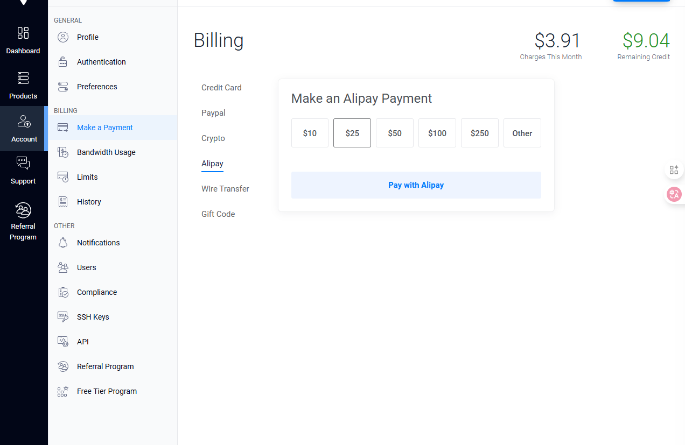

    具体操作如上图所示，依次点击左侧的`Account`,`Make a Payment`,`Alipay`，之后选择自己需要充值的金额进行充值即可。

现在开始下一步：

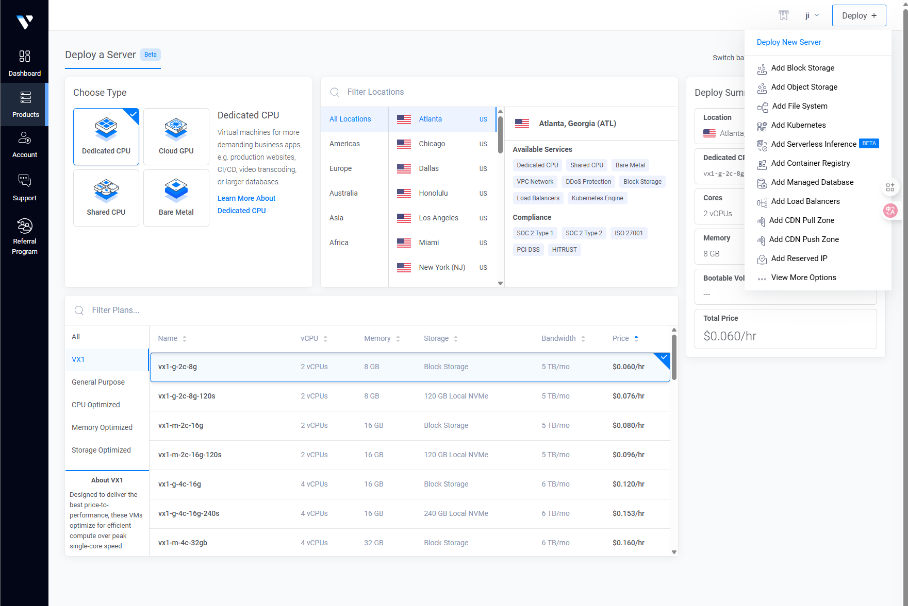

    点击右上角的deploy创建服务器。

    现在点击`Shared CPU`，选择要配置的服务器地址，注意右侧的`Automatic Backups`，这是自动续费，最好关闭，以防忘记这个服务器继续扣钱。

    套餐选择只需要最低的配置，也就是每个月5刀的最低配置即可。

    之后点击右下角的`Configure`进入下一步。

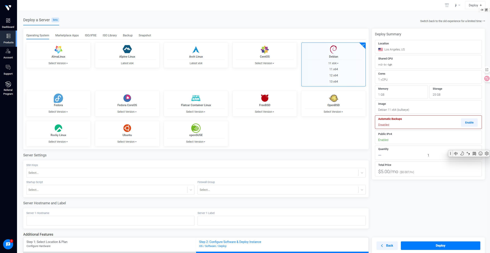

    首先点击图中的`Debian`中的`11 x64`。

    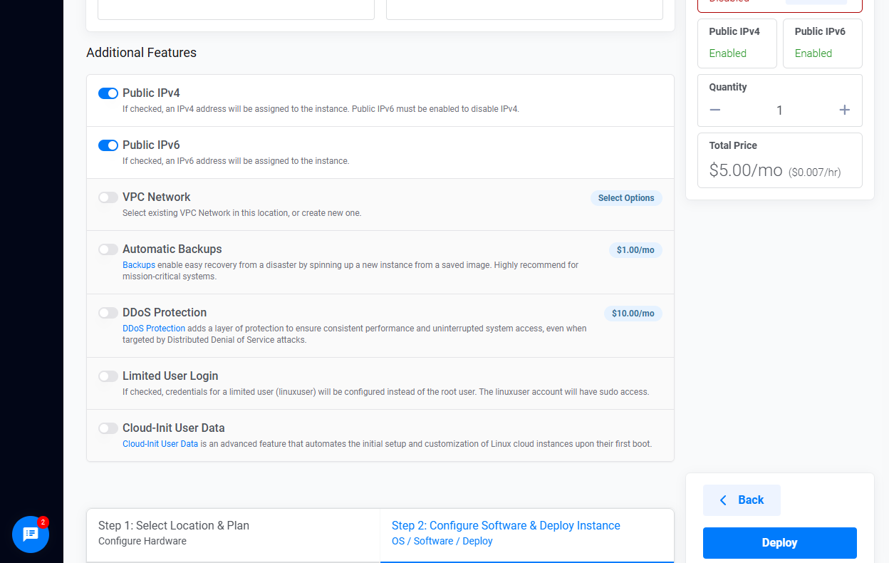

    这里的`ipv6`可以打开。

    之后点击右下角的`Deploy`。

注意事项：同样的服务器位置，不同的宽带类型和地区所搭建的账号的速度都会有所不同，这与不同的运营商有关。所以可以先选定一个服务器位置来按照教程进行搭建，熟悉搭建方法，当账号搭建完成并完成bbr加速后，可以先测试速度是否满意，如果满意的话直接使用即可。如果速度不理想，可以一次性多开几个服务器，然后按照同样的方法来进行搭建并测试，选择最优的，之后将其他的服务器都删除，这里由于是按小时计费，测试成本可以忽略不记。

### 部署VPS服务器

在购买服务器之后，需要部署一下。
由于你购买的是虚拟东西，而且又远在国外，所以我们需要一个叫Xshell的软件来进行远
程部署，(Xshell下载地址)[www.xshell.com]， 目前xshell是免费的，所以我们在官
网找到下载地址安装即可。

按照系统提示的默认方式，对xshell进行安装，之后使用管理员权限对软件进行运行。

之后进入一下界面

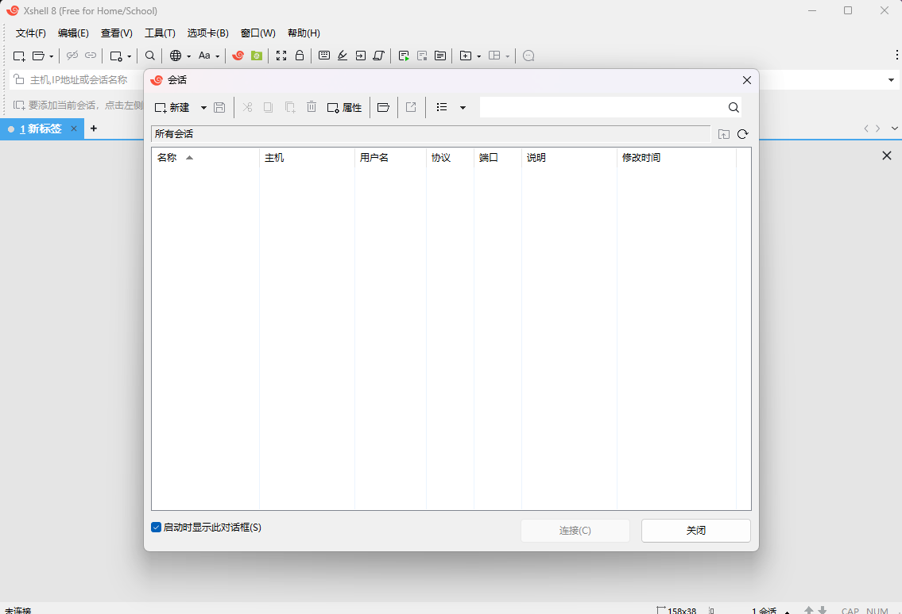

点击对话框`会话`左上角的`新建`：

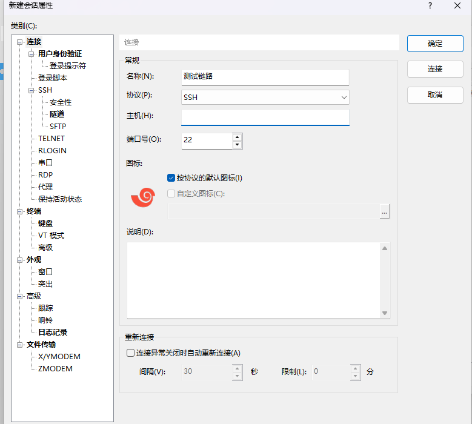

填写对应名称，之后输入主机号，也就是刚才购买的虚拟VPS服务器的ip地址。
按照刚才创建的服务器的password正常填入即可。

进入以下xshell配置界面：

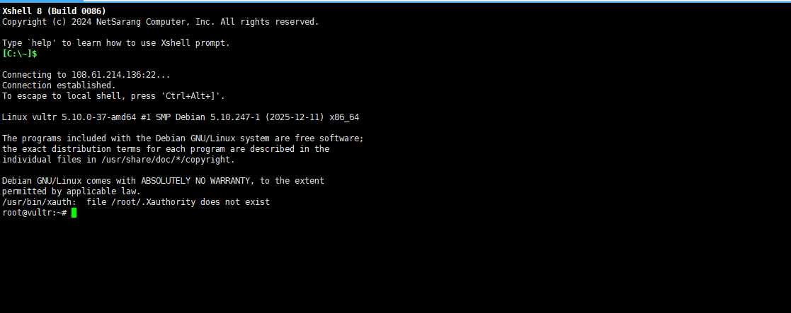

输入以下脚本：(直接复制即可)

    yum -y install wget

    wget -N –no-check-certificate https://raw.githubusercontent.com/ToyoDAdoubi/doubi/master/ssr.sh && chmod +x ssr.sh && bash ssr.sh

之后输入：`bash ssr.sh`进入以下图形界面进行设置，以后只要输入刚才的快捷命令就可以直接界面直接进行设置。

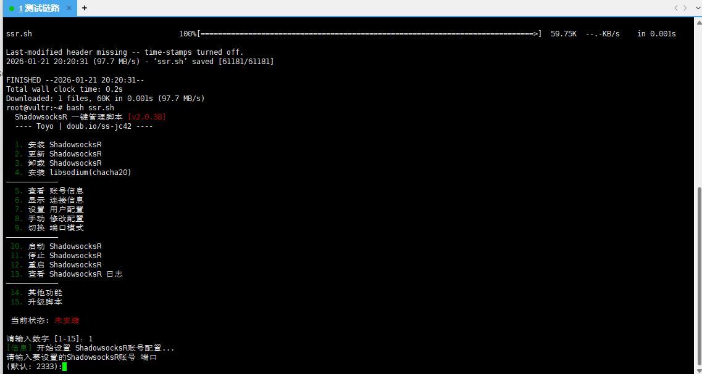

按下数字1安装shadowsocksr，之后输入端口号，可以使用默认的2333：
之后配置对应的密码即可。

输入10，选择加密方式

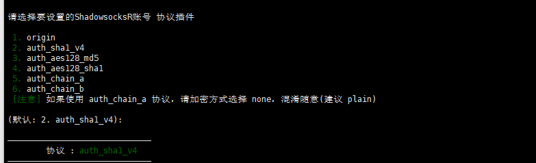

这里的协议插件可以直接选择默认的就行

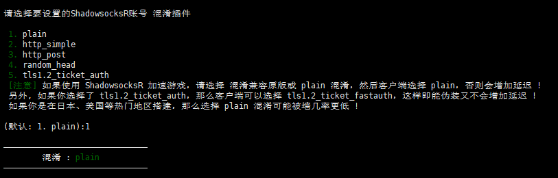

混淆插件也类似，这边也推荐直接使用默认的就行。

以下的依靠自己需要输入即可。

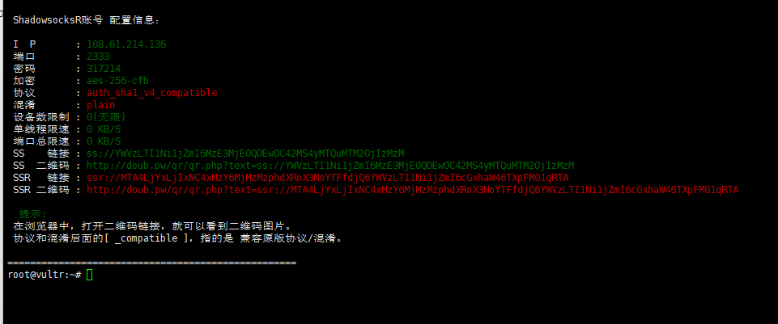

当出现这一栏的时候，就说明你的服务器已经部署成功了。

### 加速VPS服务器

此加速教程为谷歌BBR加速，vultr的服务器框架可以装BBR加速，加速后对速度的提升很明显，所以推荐部署加速脚本。该加速方式是开机自动启动，只需要部署一次即可。

首先在命令行中输入：

apt update

未完待续

## 使用教程

购买vps服务器端后，ip有了，通过部署，端口、密码、加密方式、协议、混淆也有了最
后只需要将这些信息填写到SSR客户端即可。

之后可以测试是否可以上网了。

注意：本教程的目的仅仅为了学习研究，一切出于其他目的行为都与本人无关。